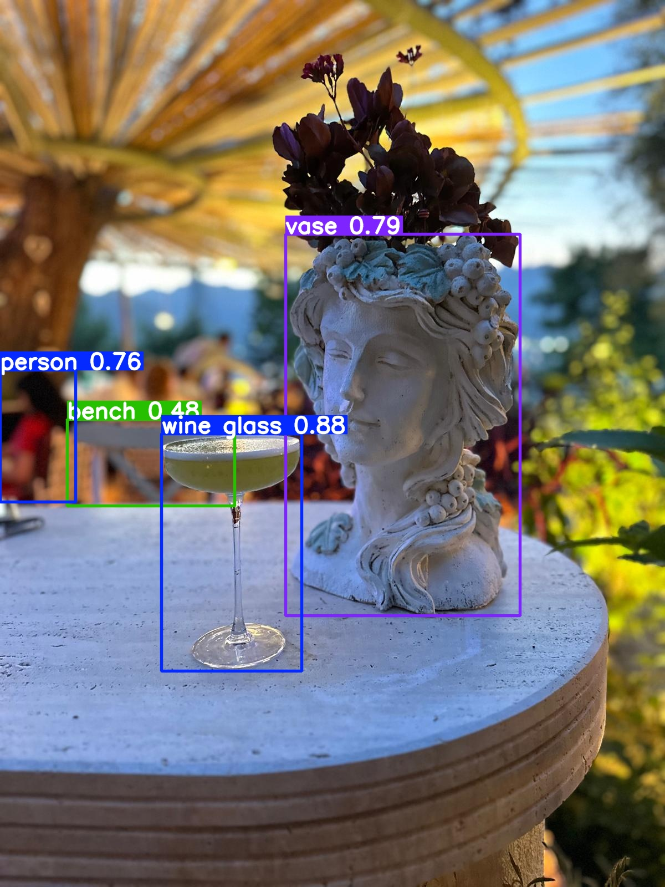
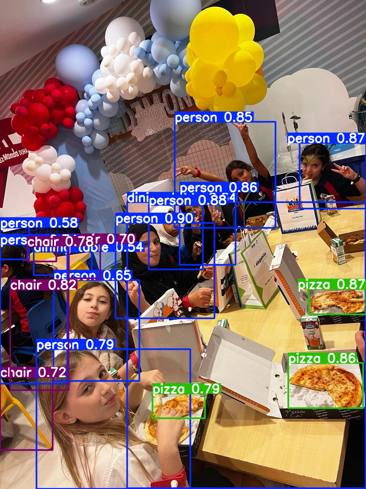
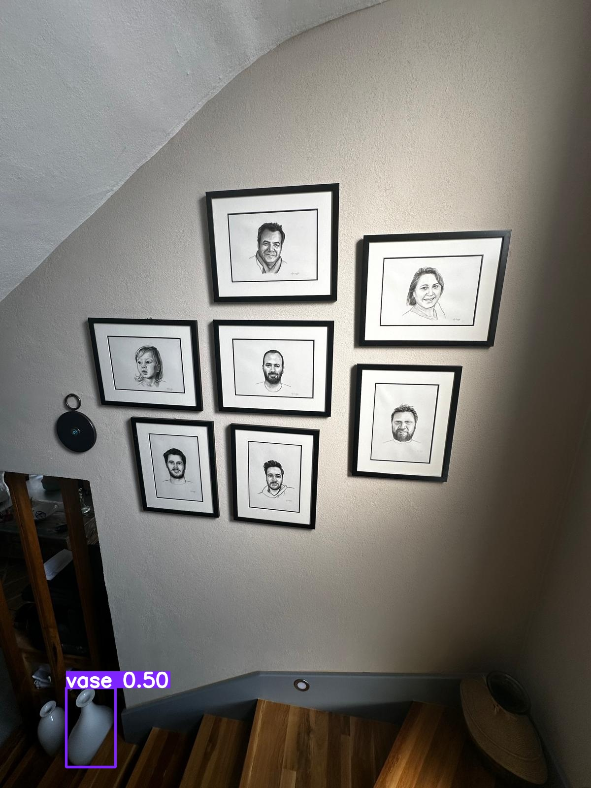
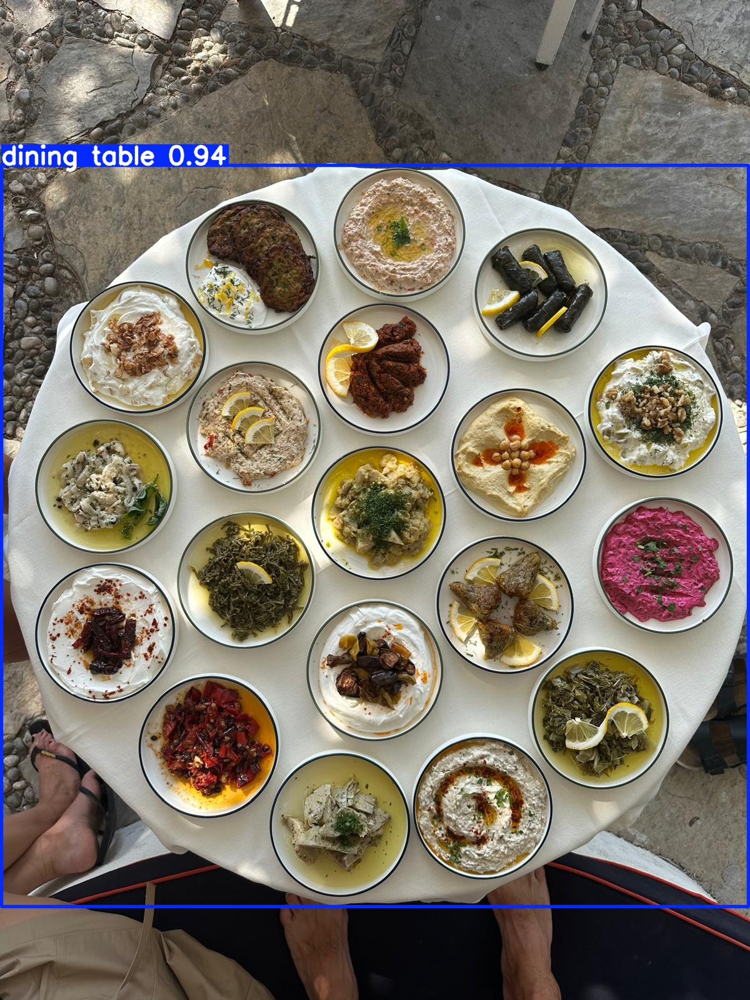
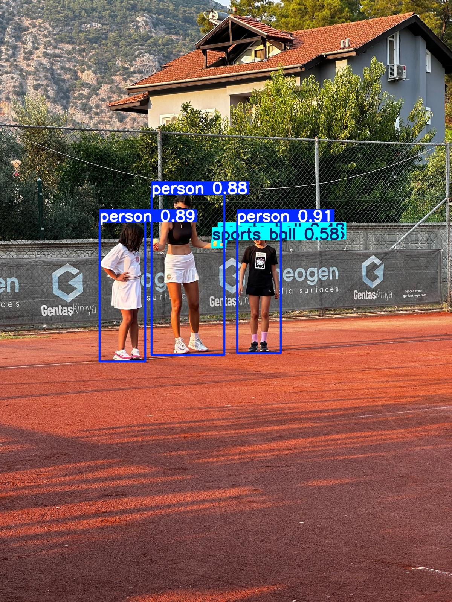
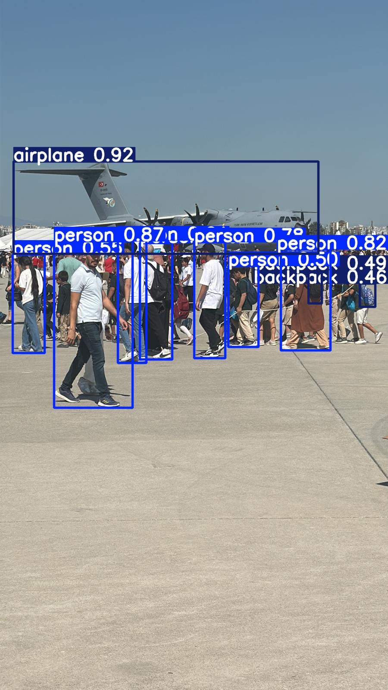
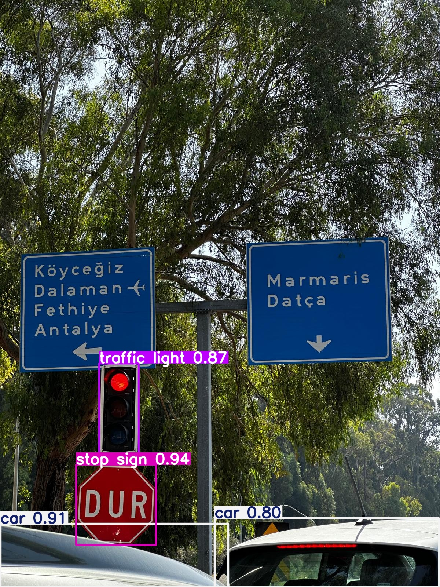
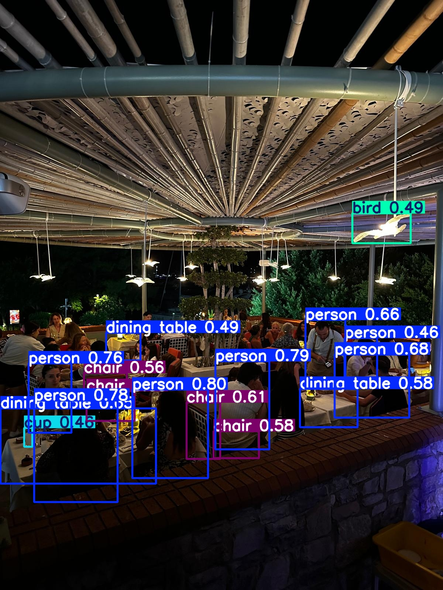
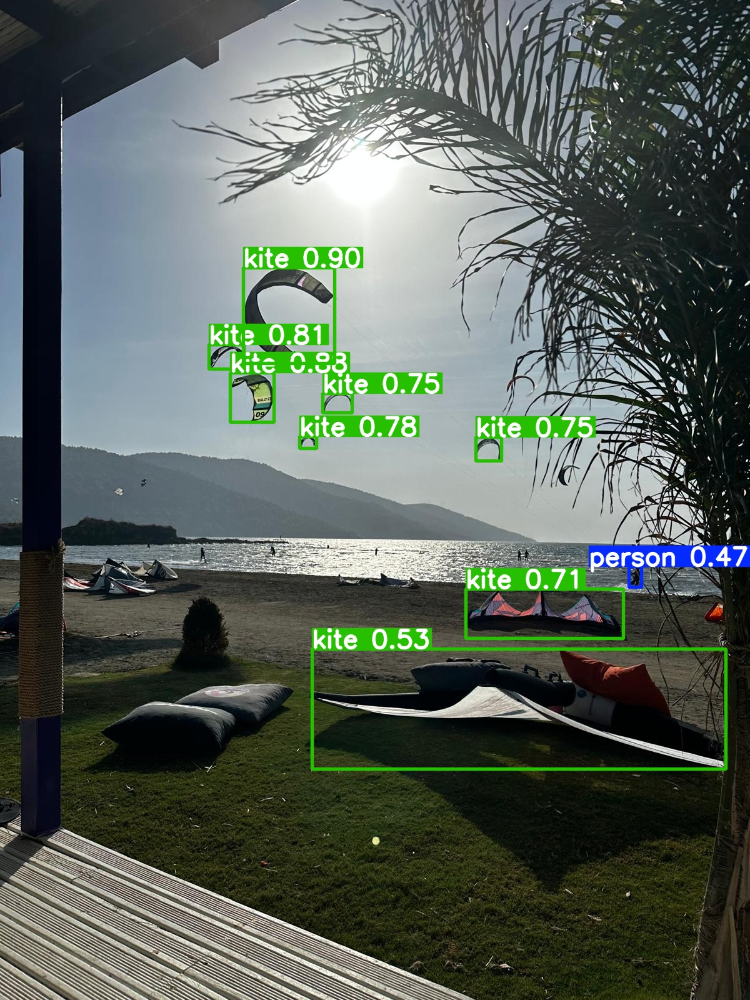
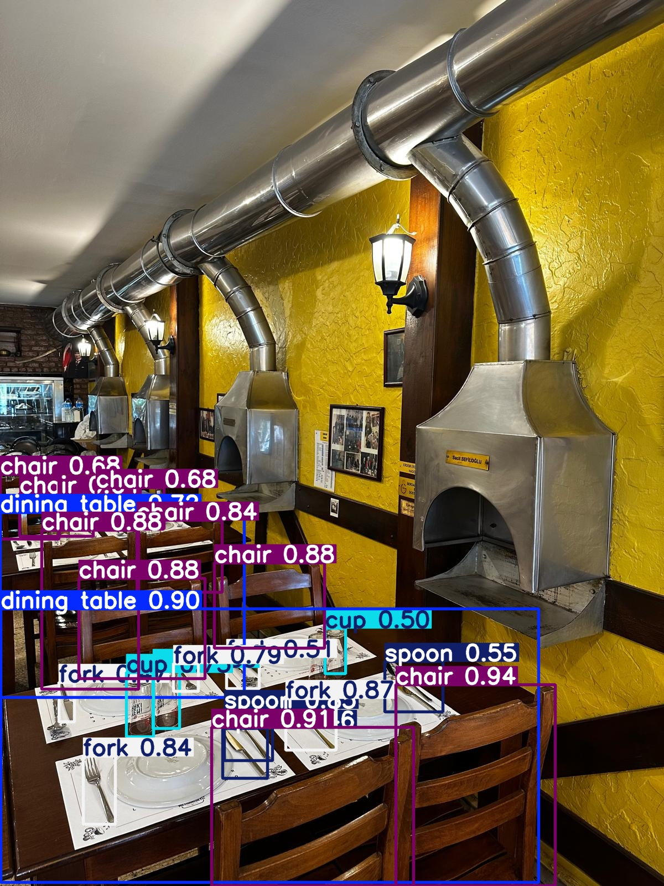

# Ödev 2

## Bu projede Ultralytics'in Yolo11x modeli kullanılarak çektiğim fotoğraflardaki nesneleri modele tanımlatarak sonuçları yorumladım.

## Gereklilikler

Ultralytics
Torch
Matplotlib

## Sonuçlar

# 1 Numaralı Görsel

Bu testde yakın plan bir fotoğraf kullanıldı. 
Önemli bir detay olarak modelimiz flu dahi olsa arkadaki insanı yüksek doğrulukla tahmin ederken, daha uzakta yer alan insanı göremedi. 

# 2 Numaralı Görsel

Bu testte insanları ve pizzayı yüksek doğrulukla tahmin edebilen modelimiz, görselin geniş kısmında yer alan balonları tahmin edemedi.

# 3 Numaralı Görsel

Bu testte duvarda kara kalem çizilmiş portreleri göremeyen modelimiz yerde duran vazolardan sadece birini %50 doğrulukla tahmin etti.

# 4 Numaralı Görsel

Yüksek doğrulukla yemek masasını tahmin eden modelimiz, frame'de yer alan yemekleri bütünün bir parçası olarak kabul edip detaya inmedi.

# 5 Numaralı Görsel

Bu testte insanları kolaylıkla algılayan modelimiz, tenis topunu spor için kullanılan top olarak %58'lik bir değerlendirmeyle tahmin etti. Arkada yer alan büyük evi görmedi.

# 6 Numaralı Görsel

Bu testte yoğun insan trafiğini başarıyla gören modelimiz, 5. görselin aksine arkadaki uçağı da tahminlerine ekledi.

# 7 Numaralı Görsel

Bu testte trafik lambası, dur ve arabayı tahmin eden modelimiz bize modelin yaklaşımıyla ilgili ipuçları veriyor.

# 8 Numaralı Görsel

3 Numaralı görselde karakalem olarak çizili insan portrelerini tahmin edemeyen modelimiz, bu görselde el yapımı camdan yapılan kuşu %49'luk bir tahmin oranıyla değerlendirmeye alıyor fakat arkadaki kuşları değerlendirme dışında bırakıyor. İnsan tahmini ise yine en önce yer alıyor.

# 9 Numaralı Görsel

Bu testte havadaki uçurtmaları çok iyi tahmin eden modelimiz yerdeki uçurtmayı da yüksek bir tahmin oranıyla sonuçlara ekliyor. Fakat yerde duran yastıkları net olmasına rağmen tahmin dışında bırakıyor fakat uzakta yer alan insanı yine tahminlerine ekliyor.

# 10 Numaralı Görsel

Bu testte duvardaki aplikleri tahminleri dışında bırakan model, masa, sandalye ve yemek takımları üzerine tahminlerde bulunuyor.

# Video Testi

Bu testte hızla giden uçakları, yerdeki insan ve motorsikleri yüksek oranla tahmin eden modelimiz, uçakların küçülmesiyle uçakları uçurtma ile karıştırmaya başlıyor. Fence'lerin Train olarak hatalı tespit edilmesi kelimenin farklı anlamda kullanılmasıyla ilgili olabilir.

Tüm bu testler sonucunda modelin öncelikli olarak insan, araç, uyarılar gibi konularda tahminlerde bulunmaya eğilimi olduğunu görüyoruz. Genel olarak insan ve insan ile ilişkili objelerde tahminler yürütürken, arka planda yer alan objeler sonuçlandırılmıyor.

Yolo11 modeli kullanırken, insan ve araçların yer aldığı görsellerde dikkat etmek gerekiyor.